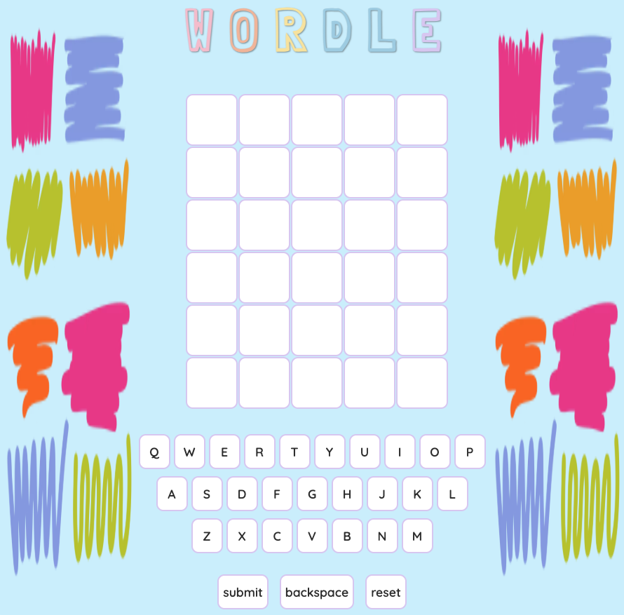

## Game Name: Wordle
### *Description*
Wordle is a browser game that allows each user six guesses to guess the correct word automatically generated by the computer. 

### *Why did I choose this game?*
I chose Wordle because many of my friends and family already enjoy this game. I wanted to build a game that would interest the people in my life testing the game for me.

### *Getting Started*
[Play the Game](https://tpiol.github.io/wordle/)

> ***How to Play***
* Each player will be given six tries to guess the correct word.
* If a word is not in the Wordle dictionary, it will say "this is not a valid word".
* If you guess a word inside the Wordle dictionary, it will then show you:  
          : green means the letter is in the correct spot.  
         : yellow means a correct letter is in the wrong spot.  
         : coral means the letter is not in the word. 
         
 *Planning Materials* 
[Google Document with Pseudocode](https://docs.google.com/document/d/1gtlAY04K4TAGAwa_mrSyph8IevC9-IpYUjomyXTfrrE/edit?tab=t.0)

### Attributions
* [ChatGPT](https://www.chatgpt.com) - for coding guidance and troubleshooting
* [MDN](https://developer.mozilla.org/en-US/) - for reference on JavaScript, HTML, and CSS
* [UnSplash](https://www.unsplash.com) - for my background image

### Technologies Used
* JavaScript
* HTML
* CSS

### Next Steps
* Add a hints section to the game, the real Wordle game offers up to three hints.
* Add sound effects for feedback (correct guess, wrong guess, invalid word, etc.)
* Figure out how to flip each card one by one. 

